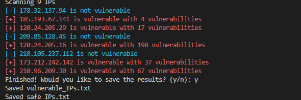
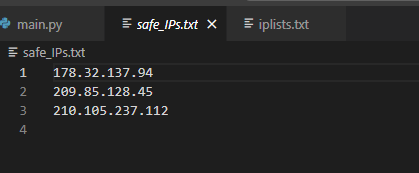
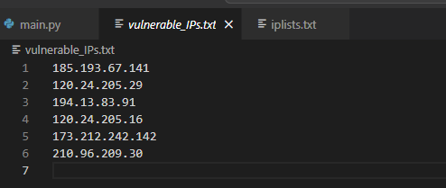

# Mass CriminalIp Scanner :mag_right::arrow_lower_left:
**Mass CriminalIP Scanner** literally mass checks IP addresses through Criminalip asset search api and shows if there are any vulnerabilities :space_invader:

## Prerequisites :unlock:
Before you start, you need to get Criminal IP API Key through [criminalip.io](https://www.criminalip.io/)
> Required API: [https://www.criminalip.io/developer/api/get-asset-ip-report](https://www.criminalip.io/developer/api/get-asset-ip-report)

## Installation and Setup :unlock:
:arrow_down_small: Go to the 'criminalip_MassScanner.py' file, and insert the API key into the 'apikey' variable. <br>
:arrow_down_small: If you want to add more IP addresses, just put them in 'iplists.txt'.

```python
python3 main.py iplists.txt
```

## Images :memo:


